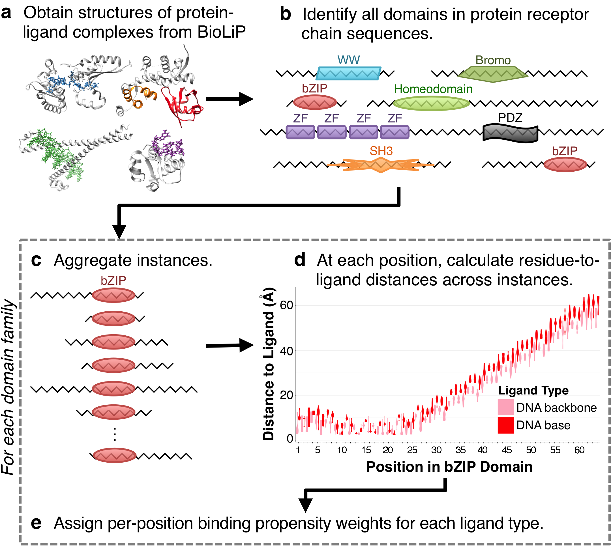

# Compute Site-Based Ligand-Binding Propensities across the InteracDome 
<div align="center"></div><br />

In this project, we use information from protein co-complex structures to determine how individual positions 
within domains may be involved in binding different ligands. If you use data or scripts from this repository, 
please cite:

> Kobren, S.N. and Singh, M. (2018) "Data-driven discovery of the InteracDome." *Manuscript in preparation.* [InteracDome Web Server](https://interacdome.princeton.edu "InteracDome")

### 1: Downloading preliminary data

* To download the *primary set* of BioLiP data, released March 6, 2013, run the following. **Note that this 
step can take a long time and will require substantial hard drive space (4.1GB).**

```bash
python download_biolip.py --initialize
```


* You **must** update the BioLiP data that you just downloaded (as BioLiP releases weekly updates) by running:

```bash
python download_biolip.py
```

### 2: Computing distances between atoms

* To calculate pairwise Euclidean distances between receptor residue atoms and ligand atoms, run: 

```bash
python calculate_distances.py --prefix XX
```

**NOTE: This step also takes a long time; we suggest running in parallel.**
 The --prefix option allows you to specify 
a subset of PDB IDs that begin with a specific 2-character prefix (e.g., 2m). 

* To get the set of all possible prefixes, run:

```bash
ls downloaded_data/receptor/ -1 | cut -c1-2 | sort -u
```


### 3: Computing ligand-proximity scores for each protein position


We suggest using a simple and intuitive score (i.e., ''mindist'') to measure the distances between protein side chains and bound ligands. 

* To calculate the distances between each receptor amino acid residue and all corresponding ligand types, run: 

```bash
python create_fasta.py --distance mindist --prefix XX
```

*NOTE: Alternate ways of measuring the proximity between a protein receptor chain and ligand (which we found to result in highly correlated values and to take a much longer time to run) are described at the bottom of this page.*

### 4: Finding protein domains in co-complex structures

You can use whatever method you prefer to find domains in your protein receptor chain sequences. 

In our paper, we downloaded all [Pfam-A (version 31)](http://pfam.xfam.org) domains and ran [HMMER](http://hmmer.org) 
locally to find domain hits. General code to run this step of the pipeline can be found at 
<https://github.com/Singh-Lab/run-hmmer>.

* The output of these steps, run on BioLiP (version 2017-06-28) can be obtained by running:
 
```bash
if [ ! -d processed_data/domains ]; then mkdir processed_data/domains; fi
BIOLIP_DOMAINS="BioLiP_2017-06-28-domains-pfam_v31.tsv.gz"
wget http://compbio.cs.princeton.edu/interacdome/$BIOLIP_DOMAINS -O processed_data/domains/$BIOLIP_DOMAINS
```

*NOTE: If you choose to run this domain-finding step independently, you must format the results to 
match the tab-delimited formatting in the file provided (to run subsequent steps of the pipeline).*

### 5: Computing per-domain-position ligand-binding propensities

The "uniqueness" of each domain sequence must be assessed to account for structural redundancies across 
PDB entries. To do this, we generate multiple sequence alignments for each domain in contact with each type of ligand, 
and then assign per-sequence scores as in 
[S Henikoff & JG Henikoff (1994)](http://dx.doi.org/10.1016/0022-2836(94)90032-9).

* To get per-domain-instance uniqueness weights, run:

```bash
python evaluate_uniqueness.py --create_alignments --distance mindist
python evaluate_uniqueness.py --distance mindist
```

* Finally, we use the per-domain sequence uniqueness evaluations generated in the previous step to assign per-domain-position binding propensities, for each ligand type:

```bash
python generate_domain_scores.py --distance mindist
```

### 6: Cross-validating the precision of binding propensities

Next, we compute the 10-fold cross-validated precision at different binding propensity thresholds for each domain-ligand pair. 

* To get the cross-validated precision achieved at each binding propensity, run:

```bash
python cross_validate_scores.py --start X --end X
```

*NOTE: This step may take a long time.* You have the option of specifying a subset of domains to run on. The minimum allowed start index is 0, and the maximum end value is the total number of domains for which there are binding propensities. 

* To find the total number of domains to iterate over, run:

```bash
ls processed_data/domains/binding_scores/mindist | wc -l
```

---

*NOTE: The following scripts run optional steps.*

### Grouping small molecule ligand types

The previous steps automatically group ligands into the *ION_*, *DRUGLIKE_* and *METABOLITE_* 
super groups using molecular information from the [Chemical Component Dictionary](http://www.wwpdb.org/data/ccd), 
[DrugBank](http://www.drugbank.ca) and the [Human Metabolome Database](http://www.hmdb.ca) respectively, resulting in
 the following file (provided in this repository):
 
```bash
downloaded_data/ligand_groups.txt
```
 
To repeat these steps to generate an up-to-date version of the file, the following script can be run 
(this code likely requires additional configuration). You first need to install the command-line program 
`babel` from <http://openbabel.org/wiki/Main_Page>.

```bash
python group_ligand_types.py
```

### Computing alternate binding propensity scores

There are multiple ways to assign a continuous ligand-specific binding score to each amino acid residue in a 
protein receptor chain. These scores are summarized in the table below, where "receptor-ligand atom pair" always
refers to a heavy (i.e., non-hydrogen) atom from the *side chain* of the amino acid residue at a particular position
in the protein receptor chain, paired with a heavy atom from the ligand.

| Abbreviation | Score Name | Brief Description | 
| ------------ | -------- | :----------------- |
| *mindist* | minimum distance | minimum distance (in &#8491;) across all receptor-ligand atom pairs for each position in the protein receptor chain
| *fracin4* | fraction within 4&#8491; | fraction of heavy, side-chain atoms that are within 4.0&#8491; of the ligand |
| *maxstd* | maximum overlap area between normals with &sigma;=1.5 | maximum total overlap area (integrated from -&#x221e; to &#x221e;) between each heavy side-chain receptor atom and *all* heavy ligand atoms, where the two Gaussian distributions &phi;(&mu;=0; &sigma;=1.5) and &phi;(&mu;=D; &sigma;=1.5) are centered at each atom in the receptor-ligand atom pair, and where D is the Euclidean distance between the two specified atoms | 
| *meanstd* | average " &sigma;=1.5 | as above, but the **average** (across all heavy side-chain receptor residue atoms) total overlap area  | 
| *maxvdw* | maximum " &sigma;=vdw radii | the maximum total overlap area (as in *maxstd*) but where the standard deviations of each Gaussian distribution in a receptor-ligand atom pair are set to the van der Waals interaction radii of the respective atoms (rather than a uniform 1.5).
| *meanvdw* | average " &sigma;=vdw radii | as above, but the **average** total overlap area |

To use the *maxstd*, *meanstd*, *maxvdw*, or *meanvdw* binding propensity calculations, you **must** first compute the overlap area between two partially overlapping Gaussian distances. 

* Update the previously-computed distance files by running: 

```bash
python calculate_distances.py --update_overlap --prefix XX
```

* Then, generate alternate binding propensity scores by running:

```bash
python create_fasta.py --distance <abbreviation> --prefix XX
python evaluate_uniqueness.py --create_alignments --distance <abbreviation>
python evaluate_uniqueness.py --distance <abbreviation>
python generate_domain_scores.py --distance <abbreviation>
```

### Measuring standard errors and distance consistencies

In our paper, we also present results showing the bootstrapped standard error of all binding propensities, across domain-ligand pairs, as well as consistencies of domain-to-ligand distances across 50-50 random splits of domain-ligand pair instances. 

* To generate bootstrapped standard errors of binding propensities, run:

```bash
python cross_validate_scores.py --stderr --start X --end X
```

* To generate distance consistencies for each domain-ligand pair, run:

```bash
python cross_validate_scores.py --consistency --start X --end X
```